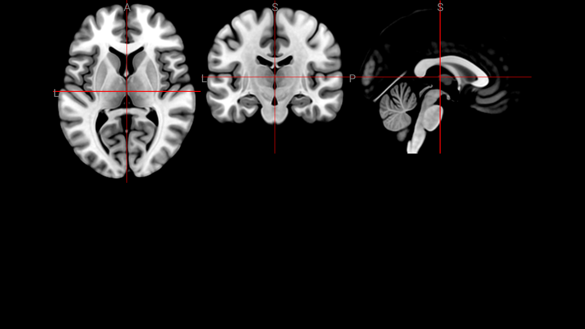
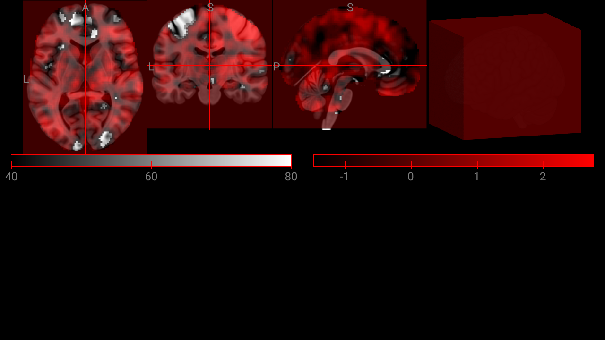
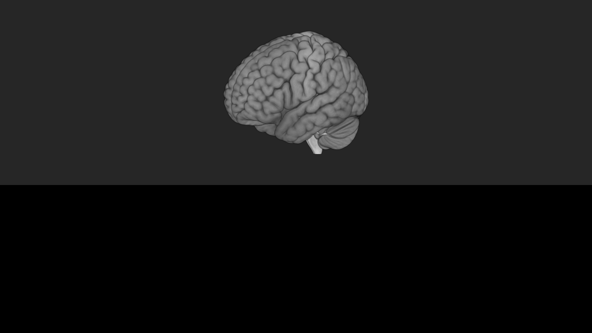
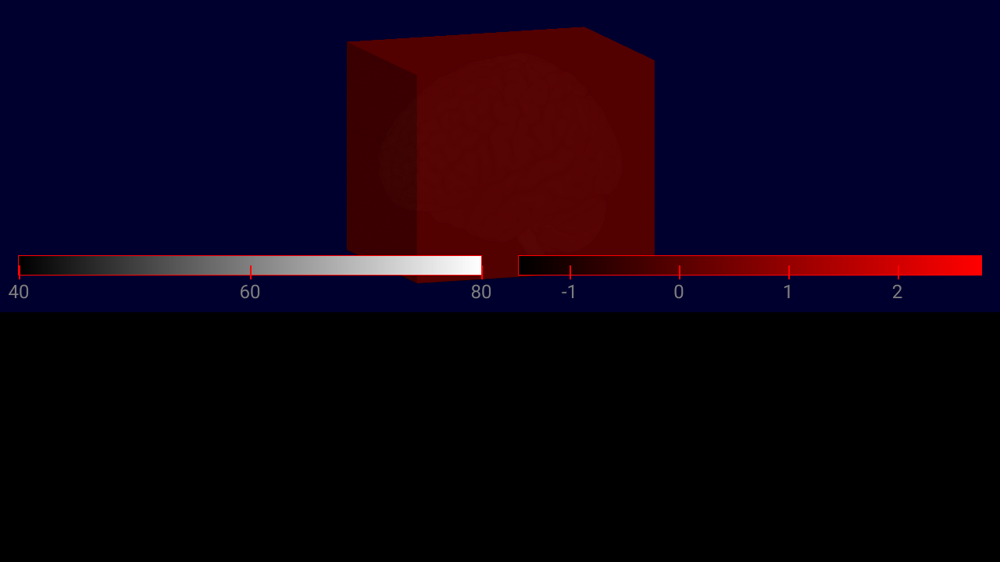
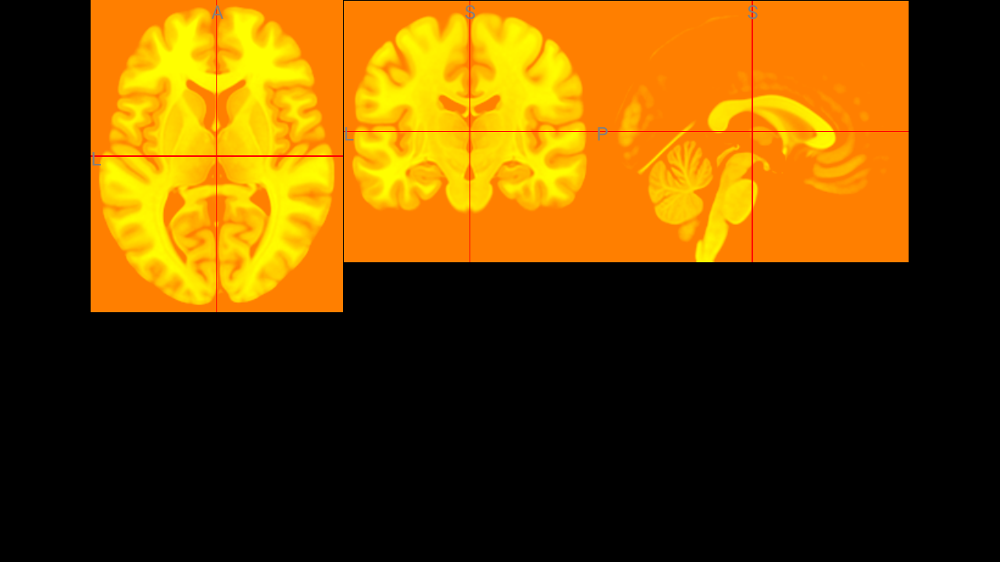

# Gallery

Browse examples below. Each entry shows the **actual code** used to produce the screenshot.
More examples are available in the [`examples/`](https://github.com/korbinian90/Niivue.jl/tree/main/examples) folder of the repository.

---

## Random Array Volume

Display a random Julia array as a brain volume — the simplest way to get started.



```@eval
using Markdown
code = read(joinpath(@__DIR__, "..", "..", "examples", "gallery", "array_volume.jl"), String)
# Strip the YAML front-matter header
code = replace(code, r"^# ---\n(# [^\n]*\n)*# ---\n*"s => "")
Markdown.parse("```julia\n" * code * "\n```")
```

---

## Volume Overlay

Load two brain volumes with different colormaps and overlay them with transparency.



```@eval
using Markdown
code = read(joinpath(@__DIR__, "..", "..", "examples", "gallery", "overlay.jl"), String)
code = replace(code, r"^# ---\n(# [^\n]*\n)*# ---\n*"s => "")
Markdown.parse("```julia\n" * code * "\n```")
```

---

## Brain Mesh

Load and display a 3D brain surface mesh with a curvature overlay layer.



```@eval
using Markdown
code = read(joinpath(@__DIR__, "..", "..", "examples", "gallery", "mesh.jl"), String)
code = replace(code, r"^# ---\n(# [^\n]*\n)*# ---\n*"s => "")
Markdown.parse("```julia\n" * code * "\n```")
```

---

## Multiplanar View

Display brain volumes in a multiplanar layout with axial, coronal, sagittal, and 3D views.



```@eval
using Markdown
code = read(joinpath(@__DIR__, "..", "..", "examples", "gallery", "multiplanar.jl"), String)
code = replace(code, r"^# ---\n(# [^\n]*\n)*# ---\n*"s => "")
Markdown.parse("```julia\n" * code * "\n```")
```

---

## Custom Synthetic Volume

Create a procedurally generated sphere volume in Julia and display it directly — no files needed.



```@eval
using Markdown
code = read(joinpath(@__DIR__, "..", "..", "examples", "gallery", "custom_array.jl"), String)
code = replace(code, r"^# ---\n(# [^\n]*\n)*# ---\n*"s => "")
Markdown.parse("```julia\n" * code * "\n```")
```
